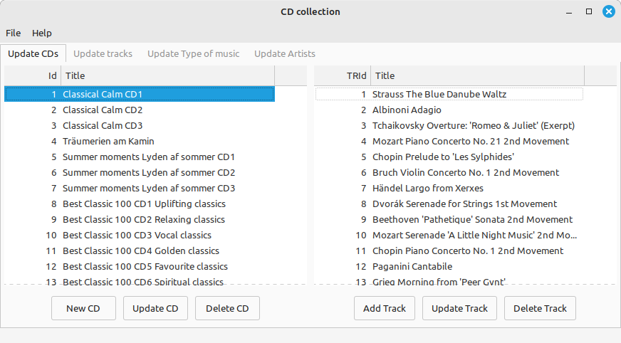

# CD Collection in C++

### This is a small application to register Collections of music CDs.

You type in the title of the CD, and the titles of the tracks 
and also the artists and type of music.  

The program has been developed using C, C++, wxwidgets and wxsmith as GUI. 
It runs only on Linux systems.  

### This is how it looks like when the program is started:

